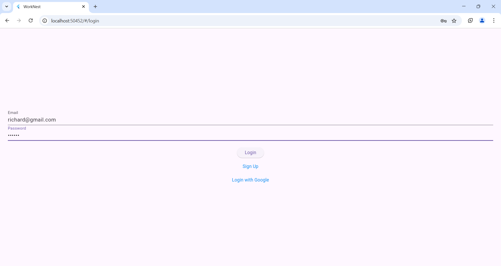
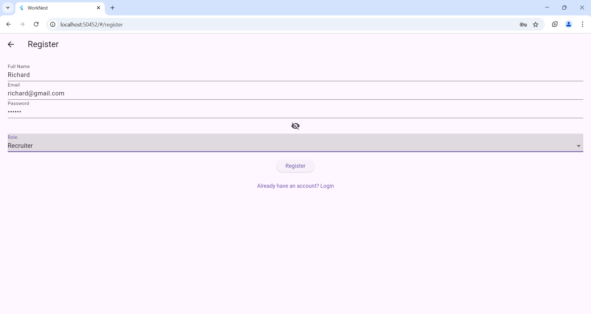
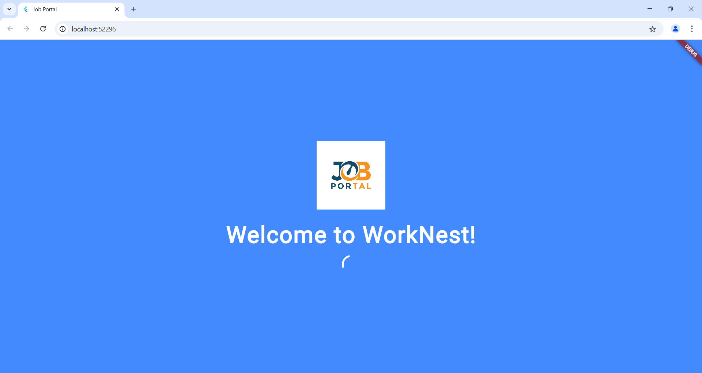
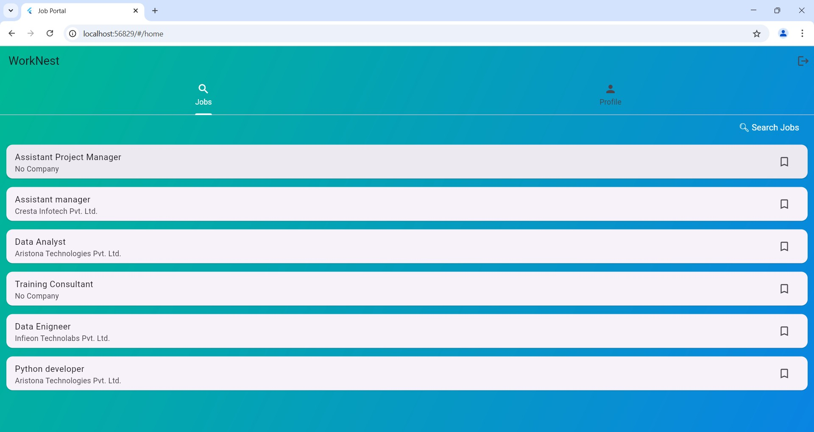
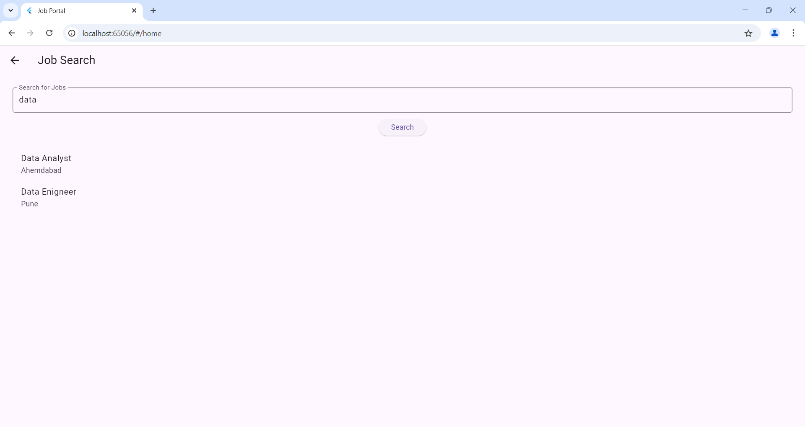
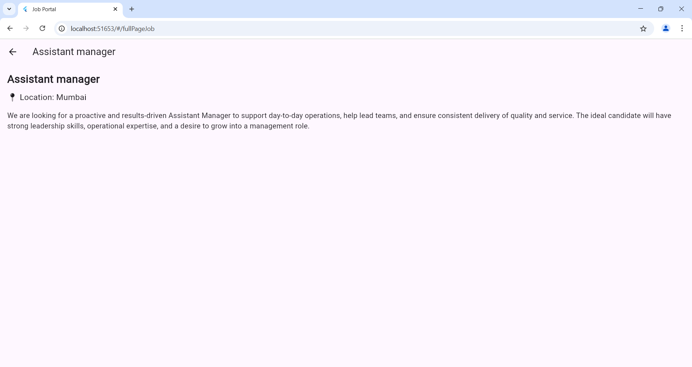
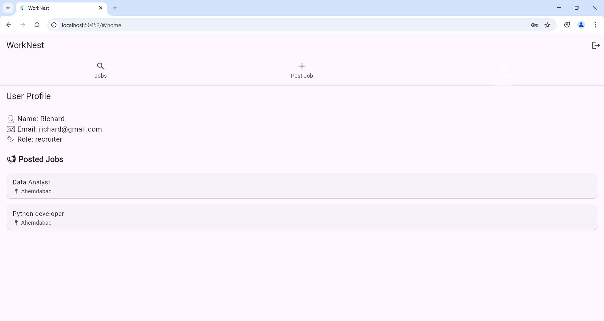
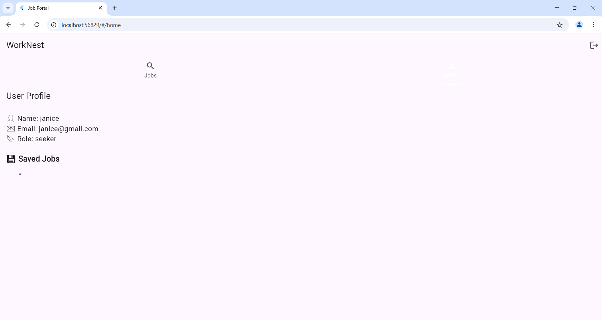

# WorkNest-Job Connector

WorkNest is a modern, user-friendly Flutter-based job portal app designed to connect job seekers with employers. Whether you're hiring or looking for your dream job, WorkNest offers a seamless and intuitive experience on mobile.

🚀 Features

🔍 Job Search: Browse and filter job listings by title, location, or type.

🧾 Post a Job: Employers can easily add job listings with role details and requirements.

👤 User Profiles: Separate views for job seekers and recruiters

💬 Interactive UI: Smooth navigation and a responsive layout.

🔐 Firebase Authentication: Secure login and registration system.

☁️ Cloud Firestore Integration: Real-time database for jobs and user data.

📱 Cross-platform: Runs on both Android and iOS.

🛠️ Tech Stack

Flutter (Dart)
, Firebase Authentication
, Cloud Firestore
, Provider / Riverpod (for state management, optional)
, Material Design

5.	Screenshots
   
1.	## Login Screen

 
2.	## Registration
  
 
3.	## Home / Feed Screen
    
 
4.	## Job Listing Page
  

6.	##Search page
  
  
7.	##Job Detail View
   
 
8.	##Profile pages
  
 
9.	##Profile pages
  
 
________________________________________
6.	Installation Guide
   
Requirements:

•	Flutter SDK (3.0+)
•	Android Studio / VS Code
•	Firebase project with Firestore & Auth enabled

Steps:

1.	Clone the repository:
git clone https://github.com/vishruti1045/WorkNest_Job_portal.git
2.	Add google-services.json to /android/app
3.	Get dependencies:
flutter pub get
4.	Run the app:
flutter run
________________________________________
7.	Conclusion
   
WorkNest successfully demonstrates a functional job portal with authentication and database integration. It bridges the gap between job seekers and recruiters through a mobile-first platform.
Future Improvements

•	Upload & attach resumes
•	Push notifications for new jobs
•	Chat functionality between seekers and employers
•	Search and filter jobs

